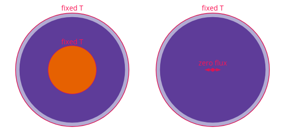

# Summary

Planetesimals, the building blocks of planets in our Solar System, are sampled by the meteorite record. Thermal processing recorded in meteorites can be linked to the thermal evolution of their parent bodies, and so can inform us of the size and geometries of these parent bodies, and how deep within them the meteorite material resided before being broken apart and distributed across the asteroid belt. Modelling the temperatures and cooling rates within these bodies that existed 4.5 billion years ago is one of the key ways to understand the geological context of meteorites.
The `Pytesimal` package focuses on the conductive cooling stage of planetesimal evolution, and provides a toolkit for modelling the temperature and cooling rate distribution inside meteorite parent bodies in 1D, with and without temperature-dependent material properties.

# Statement of need

`Pytesimal` is a Python package for modelling the thermal evolution of planetesimals and other small planetary bodies. Meteorite parent body modelling is an active field in small-body planetary science. There are two broad categories of models: those focusing on the accretion and differentiation of planetesimals, and those investigating the later conductive cooling of parent bodies [@Bryson2015; @Elkins-Tanton2011; @Haack1990; @MurphyQuinlan2021; @Nichols2016; @Sahijpal2021]. The `Pytesimal` package fits into this second category, and has already been used in a scientific publication to demonstrate that the inclusion of temperature-dependent properties such as conductivity, heat capacity and density in place of constant values can result in different interpretations of the meteorite record, with pallasite meteorites used as an example [@MurphyQuinlan2021].

`Pytesimal` will enable groups to continue to develop models of planetesimals and investigate the thermal history of meteorite parent bodies without having to rebuild the same basic architecture each time. `Pytesimal` provides a framework for modelling the conductive cooling of planetesimals, and is designed to be modular to allow future contributions and developments to be included. `Pytesimal` also includes plotting functionality to visualise the results of model runs, and a number of specialised tools designed to investigate pallasite meteorites specifically.

[//]: # (This may be the most platform independent comment)

[//]: # (Background)

[//]: # (Meteorites provide insights into some of the earliest planetary bodies in the Solar System: planetesimals, the building blocks of the planets and the asteroid belt. Unlike geological samples collected from field locations, meteorite samples often lack geological context. Modelling the evolution of small bodies in the Solar System allows us to make estimates about the conditions under which the meteorite material formed and was processed, placing the samples in context and allowing us to better understand planet building processes in the early Solar System.)

[//]: # (Potentially cut all this, include in a comment that there are also a suite of functions to address pallasite meteorite formation.)

[//]: # (Differentiated meteorites formed within bodies that melted and segregated to a certain extent, before slowly cooling. Some meteorite samples capture a cooling history attributed to this later conductive cooling stage of the parent body. One such group of meteorites, the pallasites, may have formed through a collision which caused molten metal to be injected into the olivine-rich mantle of a differentiated planetesimal [@Walte2020]. The cooling rate of this metal below 975 K following injection into the mantle is captured in Ni diffusion profiles in regions of Widmanstätten pattern [@Yang2010]. In conjunction with modelling, this cooling rate recorded at $\sim$800 K can be used to calculate the depth at which the pallasite material resided within its parent body. Paleomagnetic records in some samples indicate that a core dynamo was active when the regions of pallasite material cooled through the tetrataenite formation temperature [@Bryson2015; @Nichols2016]. )

# Method

The `Pytesimal` package focuses on the conductive cooling of differentiated planetesimals, with the ability to alter the model set-up to also investigate primitive bodies that have not segregated a core. The basic 1D set-up includes a conductively cooling discretised region which can include a low-diffusivity megaregolith layer, and an isothermal convecting core. The core can be removed to closer approximate primitive meteorite parent bodies, with a zero flux boundary condition applied across the centre to ensure symmetry (\autoref{fig:model}).

The 1D conductive cooling of the discretised region is controlled by the heat equation:

\begin{equation}
\frac{\partial T}{\partial t} \rho C=
\frac{1}{r^2} \frac{\partial}{\partial r}\left(k r^2 \frac{\partial T}{\partial r} \right) =
\overbrace{\frac{dk}{dT}\left(\frac{\partial T}{\partial r} \right) ^2} ^{\text{non-linear term}}+
\underbrace{\frac{2k}{r} \frac{\partial T}{\partial r}}_{\text{geometric term}} +
\overbrace{k \frac{\partial ^2 T}{\partial r^2}}^{\text{linear term}},
\label{eq:non_lin_heat}
\end{equation}

where $T$ is the temperature, $r$ is the radial value, $t$ is time, and $k$, $\rho$ and $C$ are the conductivity, density and heat capacity respectively. `Pytesimal` provides the capability to use temperature-dependent conductivity, heat capacity and density, with functions suitable for an olivine mantle included. These $T$-dependent material properties of olivine (\autoref{fig:matprops}) are based on experimental results and mineral physics theory from Fei2013, Robie1982, Su2018, Suzuki1975, Xu2004, with more information in @MurphyQuinlan2021.

![Conductivity ($k$) and volumetric heat capacity ($\rho C$) in olivine [@MurphyQuinlan2021].\label{fig:matprops}](material_properties.pdf)

The `numerical_methods` module uses the explicit Forward-Time Central-Space (FTCS) scheme which is conditionally stable and must satisfy Von Neumann stability criteria in 1D:
$\frac{\kappa \delta t}{\delta r ^{2}} \leq \frac{1}{2}$, where $\kappa$ is the thermal diffusivity of the material, $\delta t$ is the timestep of the numerical scheme, and $\delta r$ is the radial step [@Crank1947]. `Pytesimal.numerical_methods` includes functions to calculate the diffusivity from $k$, $\rho$ and $C$, and to check whether the chosen timestep will result in instabilities.

Boundary conditions for the top and bottom of the discretised region are passed into `numerical_methods.discretisation` as callable objects to allow for user-defined functions to be easily incorporated to extend the provided basic options. Two different boundary conditions are currently provided, illustrated in \autoref{fig:matprops}: a fixed temperature condition which can be applied to either the top or bottom boundary of the discretised region, and a zero flux boundary condition that can be applied at the bottom boundary when the core is removed.

The core interacts with the mantle through heat extracted over one timestep in the form of power (P, in Watts). The heat extracted in one timestep ($P_{\mathrm{CMB}}$) is calculated:

\begin{equation}
P_{\mathrm{CMB}} = - {A}_{\mathrm{c}} k_{\mathrm{m}} \frac{\partial T}{\partial r}\bigg\vert _{r = r_\mathrm{c}}
\end{equation}

where $A_\mathrm{c}$ is the core surface area, $r_\mathrm{c}$ is the core radius, and $k_\mathrm{m}$ is the thermal conductivity at the base of the mantle or discretised region. The core boundary temperature is then updated by $\Delta T$, the resulting change in temperature over one timestep:

\begin{equation}
\Delta T = - \frac{P_{\mathrm{CMB}}}{\rho_{\mathrm{c}} C_{\mathrm{c}} V_{\mathrm{c}}} \delta t
\end{equation}

where $\rho_{\mathrm{c}}$ and $C_{\mathrm{c}}$ are the density and heat capacity of the core, and $V_{\mathrm{c}}$ is the volume of the core. The core cools until it reaches its freezing temperature, at which point the temperature is held constant and latent heat is extracted until the total latent heat associated with core crystallisation has been removed. This core cooling method differs subtly from the method implemented in @MurphyQuinlan2021 which used an earlier version of the code that instead calculated energy extracted from the core in Joules. This simple eutectic core model ignores inner core formation and treats the liquid and solid fraction as identical, but is implemented in a way that would allow the `IsothermalEutecticCore` object to be easily replaced with a more complex core mode where applicable.

# Previous implementation

Maybe don't need this section as have already mentioned this?

# Mathematics

EXAMPLE PAPER FROM JOSS.ORG.
Single dollars ($) are required for inline mathematics e.g. $f(x) = e^{\pi/x}$

Double dollars make self-standing equations:

$$\Theta(x) = \left\{\begin{array}{l}
0\textrm{ if } x < 0\cr
1\textrm{ else}
\end{array}\right.$$

You can also use plain \LaTeX for equations
\begin{equation}\label{eq:fourier}
\hat f(\omega) = \int_{-\infty}^{\infty} f(x) e^{i\omega x} dx
\end{equation}
and refer to \autoref{eq:fourier} from text.

# Citations

EXAMPLE PAPER FROM JOSS.ORG.
Citations to entries in paper.bib should be in
[rMarkdown](http://rmarkdown.rstudio.com/authoring_bibliographies_and_citations.html)
format.

If you want to cite a software repository URL (e.g. something on GitHub without a preferred
citation) then you can do it with the example BibTeX entry below for @fidgit.

For a quick reference, the following citation commands can be used:
- `@author:2001`  ->  "Author et al. (2001)"
- `[@author:2001]` -> "(Author et al., 2001)"
- `[@author1:2001; @author2:2001]` -> "(Author1 et al., 2001; Author2 et al., 2002)"

# Figures

EXAMPLE PAPER FROM JOSS.ORG.
Figures can be included like this:

and referenced from text using \autoref{fig:example}.

Figure sizes can be customized by adding an optional second parameter:

{ width=20% }

# Acknowledgements

EXAMPLE PAPER FROM JOSS.ORG.
We acknowledge contributions from Brigitta Sipocz, Syrtis Major, and Semyeong
Oh, and support from Kathryn Johnston during the genesis of this project.

# References