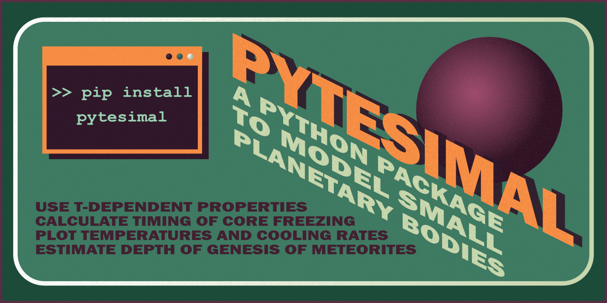

## Pytesimal is a Python package to model small planetary bodies (like planetesimals or meteorite parent bodies).

You might want to [read our documentation](https://pytesimal.readthedocs.io/), look at some [examples](https://pytesimal.readthedocs.io/en/stable/examples/), or try it out in an [interactive notebook](https://mybinder.org/v2/gh/murphyqm/pytesimal/master?filepath=example-notebooks). 

If you want to see more, you can look at our [GitHub repository](https://github.com/murphyqm/pytesimal)or read some [scientific background](https://agupubs.onlinelibrary.wiley.com/doi/10.1029/2020JE006726) to the project.

### If you want to be able to model meteorite parent bodies, calculate meteorite formation depths, and estimate the timing of core-dynamo activity, [install the package](https://pypi.org/project/pytesimal/) on your machine.

If you're having any issues, just [leave us a message](https://github.com/murphyqm/pytesimal/issues), and **please remember to [cite](https://doi.org/10.5281/zenodo.4321771) [us](https://agupubs.onlinelibrary.wiley.com/doi/10.1029/2020JE006726).**
